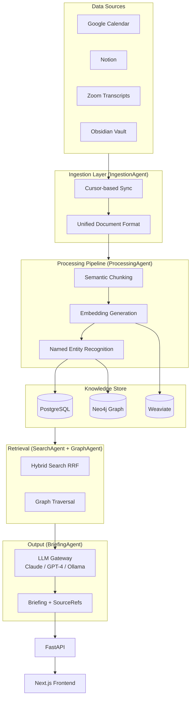

# Personal Knowledge Operating System (PWBS)

[](https://github.com/sauremilk/PWBS/actions/workflows/ci.yml)
[](https://codecov.io/gh/sauremilk/PWBS)
[](https://www.python.org/)
[](https://fastapi.tiangolo.com)
[](https://nextjs.org)

A cognitive infrastructure that continuously ingests data from heterogeneous personal sources, builds a semantic knowledge model, and delivers context-aware briefings at the right moment — so knowledge workers spend less time searching and more time deciding.

> **Status:** Phase 2 (MVP) — Closed Beta. Core pipeline (4 connectors → chunking → hybrid search → briefing generation) is functional end-to-end.

---

## What I Built and Why It's Interesting

This is a solo-built RAG system with four non-trivial engineering decisions that go beyond standard library glue:

### 1. Semantic Coherence Chunking ([ADR-021](docs/adr/021-semantic-coherence-chunking.md))

Standard chunkers split at punctuation or fixed token counts. My `SemanticCoherenceChunker` places chunk boundaries at **actual topic shifts** by computing a cosine-similarity curve over consecutive sentence embeddings and detecting local minima below an adaptive threshold (μ − σ·stddev). This makes every chunk cover one coherent topic, which measurably improves retrieval precision.

→ [`backend/pwbs/processing/semantic_chunker.py`](backend/pwbs/processing/semantic_chunker.py) — 580 LOC, no NumPy dependency, provider-agnostic embedding callback

### 2. Hybrid Search with RRF + Sigmoid Reranker ([ADR-010](docs/adr/010-hybrid-suche.md))

Vector search fails on exact proper names; keyword search can't handle synonyms. The system combines both via Reciprocal Rank Fusion (Cormack et al., SIGIR 2009), then reranks with a composite score: cosine similarity (0.6) + normalized RRF (0.3) + sigmoid-based recency decay (0.1). The recency sigmoid ensures recent documents get a boost that decays smoothly rather than cliff-dropping.

→ [`backend/pwbs/search/hybrid.py`](backend/pwbs/search/hybrid.py) + [`reranker.py`](backend/pwbs/search/reranker.py) — includes an [IR evaluation framework](backend/pwbs/search/evaluation.py) (nDCG@k, MRR, MAP, Precision/Recall@k)

### 3. LLM Gateway with Fallback Cascade and Circuit Breaker

Three LLM providers (Claude → GPT-4 → Ollama) with automatic failover. Each provider call wraps retry with exponential backoff (factor 5), transient error classification, and per-request cost tracking. External API calls are protected by a three-state circuit breaker (CLOSED → OPEN → HALF_OPEN) to prevent cascade failures.

→ [`backend/pwbs/core/llm_gateway.py`](backend/pwbs/core/llm_gateway.py) (520 LOC) + [`backend/pwbs/connectors/resilience.py`](backend/pwbs/connectors/resilience.py)

### 4. Envelope Encryption with Per-User Key Derivation ([ADR-009](docs/adr/009-envelope-encryption.md))

GDPR requires that deleting a user's account makes their data cryptographically unreadable — without re-encrypting everything. I implemented HKDF-based per-user key derivation (owner_id as salt), Fernet DEK/KEK envelope encryption, and Argon2id password hashing (64 MB memory cost). Deleting the wrapped DEK = effective data erasure.

→ [`backend/pwbs/connectors/oauth.py`](backend/pwbs/connectors/oauth.py) + [`backend/pwbs/services/user.py`](backend/pwbs/services/user.py)

---

## How It Was Built

This project was built solo over several months with the help of AI coding assistants (GitHub Copilot / Claude) for boilerplate generation and test scaffolding. All architectural decisions, algorithm designs, and trade-off evaluations are my own. The ADRs in [`docs/adr/`](docs/adr/) document my reasoning for each significant technical choice.

---

## Features

- **Data ingestion** — 4 connectors (Google Calendar, Notion, Obsidian, Zoom) via OAuth2 or local file watchers; cursor-based incremental sync
- **Processing pipeline** — semantic chunking → batch embedding → two-stage NER (rule-based + LLM) → idempotent graph writes
- **Hybrid search** — Weaviate vector similarity + PostgreSQL BM25, fused via RRF, reranked with cosine + recency
- **Context briefings** — LLM-generated briefings (morning, meeting-prep, project, weekly) backed exclusively by retrieved context with full source attribution
- **Knowledge graph** — Neo4j with weighted, time-decaying edges and pattern recognition (recurring themes, unresolved questions)
- **Graceful degradation** — Neo4j optional (3 NullService implementations), Weaviate optional, LLM cascade with cache fallback
- **GDPR by design** — per-user encryption keys, `expires_at` on every document, `DELETE CASCADE`, no LLM training on user data
- **Idempotent pipeline** — every step is safe to re-run; cursor watermarks persisted after each batch

---

## Tech Stack

| Layer              | Technology                                                                                    |
| ------------------ | --------------------------------------------------------------------------------------------- |
| **Backend**        | Python 3.12+, FastAPI, Pydantic v2                                                            |
| **Relational DB**  | PostgreSQL (users, connectors, documents, audit log)                                          |
| **Vector DB**      | Weaviate (chunk embeddings, hybrid search)                                                    |
| **Graph DB**       | Neo4j (knowledge graph, entity relationships)                                                 |
| **LLM**            | Anthropic Claude (primary), OpenAI GPT-4 (fallback), Ollama (local/offline)                   |
| **Embeddings**     | OpenAI `text-embedding-3-small` (cloud), `all-MiniLM-L6-v2` via Sentence Transformers (local) |
| **Frontend**       | Next.js (App Router), React, TypeScript, Tailwind CSS                                         |
| **Infrastructure** | Docker Compose (local), Vercel (frontend), AWS ECS Fargate + RDS + ElastiCache (backend)      |
| **Task queue**     | Celery + Redis (active in MVP: ingestion, processing, briefing queues)                        |
| **Migrations**     | Alembic                                                                                       |
| **Testing**        | pytest, pytest-asyncio                                                                        |

---

## Prerequisites

- Docker and Docker Compose
- Python 3.12+
- Node.js 20+
- API keys for at least one LLM provider (Anthropic or OpenAI) and one embedding provider
- OAuth2 application credentials for any connectors you want to enable (Google, Notion, Zoom)

---

## Installation

### 1. Clone the repository

```bash
git clone https://github.com/sauremilk/PWBS.git
cd PWBS
```

### 2. Configure environment variables

```bash
cp .env.example .env
# Edit .env — see Configuration section for required variables
```

### 3. Start backing services

```bash
docker compose up -d
# Starts PostgreSQL, Weaviate, and Redis
# Neo4j (Knowledge Graph) is optional — activate with:
#   docker compose --profile graph up -d
```

### 4. Set up the backend

```bash
cd backend
python -m venv .venv
source .venv/bin/activate   # Windows: .venv\Scripts\activate
pip install -e ".[dev]"

# Run database migrations
alembic upgrade head

# Start the API server (hot-reload)
uvicorn pwbs.api.main:app --reload
```

### 5. Set up the frontend

```bash
cd frontend
npm install
npm run dev
```

The API is available at `http://localhost:8000` and the web app at `http://localhost:3000`.

---

## Quickstart

### Connect a data source

```bash
# Initiate OAuth2 flow for Google Calendar
curl http://localhost:8000/api/v1/connectors/google_calendar/auth-url \
  -H "Authorization: Bearer <access_token>"
# Returns a redirect URL — open in browser to complete OAuth consent

# Trigger a manual sync after connecting
curl -X POST http://localhost:8000/api/v1/connectors/<connection_id>/sync \
  -H "Authorization: Bearer <access_token>"
```

### Semantic search

```bash
curl "http://localhost:8000/api/v1/search?q=product+roadmap+Q2&mode=hybrid&top_k=10" \
  -H "Authorization: Bearer <access_token>"
```

### Generate a morning briefing

```bash
curl -X POST http://localhost:8000/api/v1/briefings/generate \
  -H "Authorization: Bearer <access_token>" \
  -H "Content-Type: application/json" \
  -d '{"type": "morning"}'
```

### Implementing a new connector

Every connector extends `BaseConnector` and must be idempotent:

```python
from pwbs.connectors.base import BaseConnector, ConnectorConfig, SyncResult
from pwbs.ingestion.models import UnifiedDocument

class MyConnector(BaseConnector):
    async def fetch_since(self, cursor: str | None) -> SyncResult:
        """Cursor-based fetch. Returns the new cursor for the next run."""
        ...

    async def normalize(self, raw: dict) -> UnifiedDocument:
        """Transform raw API response into the Unified Document Format."""
        ...
```

---

## Project Structure

```
backend/pwbs/           # Python 3.12 package
  api/                  # FastAPI app, v1 routes, middleware (auth, rate limit, audit)
  connectors/           # BaseConnector + 4 source implementations
  processing/           # Semantic chunking, embedding, NER, entity dedup
  search/               # Hybrid search (vector + keyword + RRF), reranker, evaluation
  briefing/             # Briefing generation with context modules
  graph/                # Neo4j knowledge graph (optional)
  core/                 # Config, exceptions, LLM gateway, encryption
  models/               # SQLAlchemy ORM (33 models)
  queue/tasks/          # Celery workers (ingestion, processing, briefing)
frontend/src/           # Next.js 15 App Router, TypeScript strict mode
docs/adr/               # Architecture Decision Records
```

---

## Configuration

All secrets and settings are loaded from environment variables. Copy `.env.example` to `.env` and fill in values — never commit `.env`.

Required: `DATABASE_URL`, `WEAVIATE_URL`, `REDIS_URL`, `JWT_PRIVATE_KEY`, `JWT_PUBLIC_KEY`, `ENCRYPTION_KEK`, and at least one LLM API key (`ANTHROPIC_API_KEY` or `OPENAI_API_KEY`). Neo4j is optional (activate with `--profile graph`). See `.env.example` for the full variable list.

---

## API Documentation

Interactive API docs (Swagger UI) are available at `http://localhost:8000/docs` in development mode. All endpoints require a JWT Bearer token; user identity is always extracted from the token, never from request bodies. Every database query filters by `owner_id`.

---

## Architecture Overview

PWBS follows a **modular monolith** pattern in the current MVP (Phase 2). All backend logic runs in a single FastAPI process; modules communicate via typed Python interfaces, not HTTP. This enables rapid iteration while keeping the service boundary clear enough for a future service split in Phase 3.



The processing pipeline runs in three stages:

1. **Chunking** — two strategies: regex-based semantic splitting (fast, default) and embedding-based coherence chunking that detects topic shifts via cosine similarity curves ([ADR-021](docs/adr/021-semantic-coherence-chunking.md))
2. **Embedding** — batch embedding generation (OpenAI or local Sentence Transformers)
3. **NER + Graph** — two-stage entity extraction (rule-based → LLM-based) followed by idempotent `MERGE` writes to Neo4j

See [ARCHITECTURE.md](ARCHITECTURE.md) for the full system design, database schemas, Weaviate collection configuration, and Neo4j graph model.

---

## Development

### Running tests

```bash
cd backend

# Unit tests (no network, no running databases required)
pytest tests/unit/ -v

# Integration tests (requires running Docker services)
pytest tests/integration/ -v --docker
```

### Creating a database migration

```bash
cd backend
alembic revision --autogenerate -m "describe your change"
alembic upgrade head
```

### Adding a new briefing type

Derive from `BriefingTemplate`, place the LLM prompt in `pwbs/prompts/`, and register the new type in the scheduler if it should run on a schedule. Every briefing must return `sources: list[SourceRef]` — the system does not deliver briefings without source attribution.

### Architecture decisions

Significant architectural decisions are documented as Architecture Decision Records in [docs/adr/](docs/adr/). Use `docs/adr/000-template.md` as the starting point for new ADRs.

---

## Contributing

1. Fork the repository and create a feature branch.
2. Follow the coding conventions in `.github/instructions/` (applied automatically by GitHub Copilot).
3. Ensure all unit tests pass before opening a pull request.
4. For significant changes, create an ADR in `docs/adr/` before writing code.
5. Do not commit `.env` or any file containing secrets.

Security issues should be reported privately rather than via public issues.

---

## License

License terms have not yet been specified for this project.
