# LAUNCH_TASKS.md – Konsolidierte Launch-Aufgaben: Closed Beta

---

## Metadata

| Feld                   | Wert                                                                                                                                                                                                                                                                 |
| ---------------------- | -------------------------------------------------------------------------------------------------------------------------------------------------------------------------------------------------------------------------------------------------------------------- |
| **Erstellt**           | 2026-03-17                                                                                                                                                                                                                                                           |
| **Ziel-Meilenstein**   | Closed Beta (10–20 Nutzer)                                                                                                                                                                                                                                           |
| **Zeitrahmen**         | 8 Wochen (4 Sprints à 2 Wochen)                                                                                                                                                                                                                                      |
| **Quelldokumente**     | [LEGAL_COMPLIANCE.md](LEGAL_COMPLIANCE.md), [GTM_PLAN.md](GTM_PLAN.md), [UX_ONBOARDING_SPEC.md](UX_ONBOARDING_SPEC.md), [TRACKING_PLAN.md](TRACKING_PLAN.md), [SUPPORT_OPERATIONS_PLAN.md](SUPPORT_OPERATIONS_PLAN.md), [RELEASE_READINESS.md](RELEASE_READINESS.md) |
| **Dedupliziert gegen** | [tasks.md](../tasks.md) (TASK-001 bis TASK-031), [CHANGELOG.md](../CHANGELOG.md) (v0.1.0: TASK-001–008 abgeschlossen)                                                                                                                                                |
| **ID-Schema**          | `LAUNCH-[CAT]-NNN` – Kategorien: LEG, REL, UX, OPS, ANA, GTM, CNT                                                                                                                                                                                                    |

---

## 1. Zusammenfassung

### Aufgaben nach Priorität

| Priorität | Bedeutung                               | Anzahl |
| :-------: | --------------------------------------- | :----: |
|  **P0**   | Blocker – Closed Beta nicht startbar    |   15   |
|  **P1**   | Wichtig – signifikante Qualitätsrisiken |   11   |
|  **P2**   | Wünschenswert – verbessert Erlebnis     |   13   |
|           | **Gesamt**                              | **39** |

### Aufgaben nach Kategorie

| Kategorie                |   P0   |   P1   |   P2   | Gesamt |
| ------------------------ | :----: | :----: | :----: | :----: |
| LEG (Legal)              |   5    |   0    |   1    |   6    |
| REL (Release & Security) |   4    |   1    |   1    |   6    |
| UX (UX & Onboarding)     |   2    |   3    |   4    |   9    |
| OPS (Operations)         |   1    |   3    |   2    |   6    |
| ANA (Analytics)          |   2    |   1    |   1    |   4    |
| GTM (Go-to-Market)       |   1    |   3    |   2    |   6    |
| CNT (Content)            |   0    |   0    |   2    |   2    |
| **Gesamt**               | **15** | **11** | **13** | **39** |

### Kritischer Pfad

```
LAUNCH-ANA-001 (PostHog deploy)
  ? LAUNCH-ANA-002 (Core Events)
    ? LAUNCH-REL-003 (E2E-Test)
      ? LAUNCH-UX-002 (TTFB validieren)
        ? LAUNCH-GTM-006 (Exit-Check)

Parallel: LAUNCH-LEG-001/002/003 (Rechtstexte) ? Einladung der Design-Partner
Parallel: LAUNCH-OPS-001 (Sentry) ? LAUNCH-OPS-002 (Grafana-Alerting)
```

Die 15 P0-Aufgaben entsprechen den 13 Must-Blockern aus RELEASE_READINESS.md (SEC-02 spaltet sich in zwei Tasks; PostHog-Deploy und Design-Partner kommen als Voraussetzungen hinzu).

### Querverweise zu tasks.md

| LAUNCH-Task    | Bezug zu tasks.md      | Anmerkung                                               |
| -------------- | ---------------------- | ------------------------------------------------------- |
| LAUNCH-REL-001 | TASK-013 (CI/CD)       | pip-audit/npm-audit als Schritt in CI-Pipeline einfügen |
| LAUNCH-REL-004 | TASK-018/024 (Alembic) | Migration-Konsistenz setzt Alembic-Setup voraus         |

TASK-001 bis TASK-008 sind laut CHANGELOG.md (v0.1.0) abgeschlossen und werden nicht dupliziert.

---

## 2. Tasks nach Kategorie

### 2.1 Legal (LEG)

---

#### LAUNCH-LEG-001: Datenschutzerklärung erstellen

| Feld                    | Wert                                                                                                                                          |
| ----------------------- | --------------------------------------------------------------------------------------------------------------------------------------------- |
| **Quelle**              | LEGAL_COMPLIANCE §5+§9 Blocker B-1, RELEASE_READINESS LEG-02                                                                                  |
| **Priorität**           | P0                                                                                                                                            |
| **Kategorie**           | LEG                                                                                                                                           |
| **Akzeptanzkriterium**  | Datenschutzerklärung ist unter `/datenschutz` im Frontend erreichbar und deckt alle 8 Datenverarbeitungskategorien aus LEGAL_COMPLIANCE §3 ab |
| **Abhängigkeit**        | –                                                                                                                                             |
| **Geschätzter Aufwand** | M                                                                                                                                             |
| **Status**              | Fertig   |

**Beschreibung:** DSGVO Art. 13/14-konforme Datenschutzerklärung erstellen. Muss abdecken: alle 8 Datenverarbeitungskategorien (Authentifizierung, Kalender, Notion, Zoom, Obsidian, Embeddings, Briefings, KI-Verarbeitung), Drittanbieter-Datenflüsse (Anthropic, OpenAI, AWS, Vercel), Speicherdauern, Betroffenenrechte und Beschwerderecht bei Aufsichtsbehörde. Empfehlung: Mit Datenschutzanwalt erstellen, Basis: Matrix aus LEGAL_COMPLIANCE §3.

---

#### LAUNCH-LEG-002: Impressum erstellen

| Feld                    | Wert                                                                              |
| ----------------------- | --------------------------------------------------------------------------------- |
| **Quelle**              | LEGAL_COMPLIANCE §5+§9 Blocker B-2, RELEASE_READINESS LEG-01                      |
| **Priorität**           | P0                                                                                |
| **Kategorie**           | LEG                                                                               |
| **Akzeptanzkriterium**  | Vollständige Anbieterkennzeichnung nach DDG § 5 ist unter `/impressum` erreichbar |
| **Abhängigkeit**        | –                                                                                 |
| **Geschätzter Aufwand** | S                                                                                 |
| **Status**              | Fertig   |

**Beschreibung:** Impressum gemäß DDG § 5 erstellen und im Frontend unter `/impressum` bereitstellen. Enthält: Name, Anschrift, Kontaktdaten, Registernummer (falls zutreffend), USt-IdNr., inhaltlich Verantwortlicher.

---

#### LAUNCH-LEG-003: AGB / Nutzungsbedingungen erstellen

| Feld                    | Wert                                                                   |
| ----------------------- | ---------------------------------------------------------------------- |
| **Quelle**              | LEGAL_COMPLIANCE §5+§9 Blocker B-3, RELEASE_READINESS LEG-03           |
| **Priorität**           | P0                                                                     |
| **Kategorie**           | LEG                                                                    |
| **Akzeptanzkriterium**  | AGB sind unter `/agb` erreichbar und enthalten Beta-Haftungsausschluss |
| **Abhängigkeit**        | –                                                                      |
| **Geschätzter Aufwand** | M                                                                      |
| **Status**              | Fertig   |

**Beschreibung:** Beta-AGB erstellen mit: Leistungsbeschreibung (Closed-Beta-Umfang), Haftungsausschluss für Beta-Phase, Nutzungsrechte an generierten Inhalten, Kündigungsregelung, anwendbares Recht (deutsches Recht). Empfehlung: Mit IT-Rechtsanwalt erstellen.

---

#### LAUNCH-LEG-004: AVVs formalisieren und unterzeichnen

| Feld                    | Wert                                                                            |
| ----------------------- | ------------------------------------------------------------------------------- |
| **Quelle**              | LEGAL_COMPLIANCE §5+§9 Blocker B-4, RELEASE_READINESS LEG-04                    |
| **Priorität**           | P0                                                                              |
| **Kategorie**           | LEG                                                                             |
| **Akzeptanzkriterium**  | AVVs mit AWS, Anthropic, OpenAI und Vercel sind formal abgeschlossen/akzeptiert |
| **Abhängigkeit**        | –                                                                               |
| **Geschätzter Aufwand** | S                                                                               |
| **Status**              | Blockiert: Formale Akzeptanz der Online-DPAs bei AWS, Anthropic, OpenAI, Vercel erfordert manuelle Aktion |

**Beschreibung:** AVV-Entwürfe finalisieren: AWS-DPA online akzeptieren, Anthropic-DPA und OpenAI-DPA unterzeichnen, Vercel-DPA akzeptieren. Provider-Prozesse können bis zu 2 Wochen dauern.

---

#### LAUNCH-LEG-005: Audit-Trail implementieren

| Feld                    | Wert                                                                                                                                                     |
| ----------------------- | -------------------------------------------------------------------------------------------------------------------------------------------------------- |
| **Quelle**              | LEGAL_COMPLIANCE §9 Blocker B-5, RELEASE_READINESS SEC-02 (Finding A09-F01)                                                                              |
| **Priorität**           | P0                                                                                                                                                       |
| **Kategorie**           | LEG                                                                                                                                                      |
| **Akzeptanzkriterium**  | Datenschutzrelevante Aktionen (Consent, Datenexport, Account-Löschung, Konnektor-Anbindung/-Trennung) werden unveränderlich in `audit_log` protokolliert |
| **Abhängigkeit**        | –                                                                                                                                                        |
| **Geschätzter Aufwand** | M                                                                                                                                                        |
| **Status**              | Offen                                                                                                                                                    |

**Beschreibung:** Audit-Log-Service implementieren, der Art. 5 Abs. 2 DSGVO (Rechenschaftspflicht) erfüllt. Protokolliert: Consent-Erteilung/-Widerruf, Datenexport, Account-Löschung, Konnektor-Anbindung/-Trennung, Login/Logout. Append-only, kein UPDATE/DELETE auf `audit_log`-Tabelle. Schließt das hohe OWASP-Finding A09-F01 aus dem Security-Audit.

---

#### LAUNCH-LEG-006: Cookie-/Tracking-Consent-Banner

| Feld                    | Wert                                                                      |
| ----------------------- | ------------------------------------------------------------------------- |
| **Quelle**              | RELEASE_READINESS LEG-06, TRACKING_PLAN §7.7                              |
| **Priorität**           | P2                                                                        |
| **Kategorie**           | LEG                                                                       |
| **Akzeptanzkriterium**  | Consent-Banner wird angezeigt, PostHog JS-SDK wird nur bei Opt-in geladen |
| **Abhängigkeit**        | LAUNCH-LEG-001 (DSE muss existieren, damit Banner darauf verlinken kann)  |
| **Geschätzter Aufwand** | S                                                                         |
| **Status**              | Offen                                                                     |

**Beschreibung:** TDDDG § 25-konformer Consent-Banner implementieren. „Ablehnen" gleichwertig prominent wie „Akzeptieren". Consent in `localStorage` speichern. Bei Ablehnung: `posthog-js` nicht laden. Nur für Client-Side-Analytics relevant (Server-Side-Events laufen unter Art. 6 Abs. 1 lit. b DSGVO ohne Consent). Spezifikation: TRACKING_PLAN §7.7.

---

### 2.2 Release & Security (REL)

---

#### LAUNCH-REL-001: Dependency-Vulnerability-Scanning in CI

| Feld                    | Wert                                                                                 |
| ----------------------- | ------------------------------------------------------------------------------------ |
| **Quelle**              | LEGAL_COMPLIANCE §9 Blocker B-6, RELEASE_READINESS SEC-02+SEC-03, SUPPORT_OPS §10 #5 |
| **Priorität**           | P0                                                                                   |
| **Kategorie**           | REL                                                                                  |
| **Akzeptanzkriterium**  | `pip-audit` und `npm audit` laufen in CI bei jedem PR und blockieren bei hohen CVEs  |
| **Abhängigkeit**        | Referenz: TASK-013 (CI/CD-Pipeline)                                                  |
| **Geschätzter Aufwand** | S                                                                                    |
| **Status**              | Fertig |

**Beschreibung:** `pip-audit` (Backend) und `npm audit` (Frontend) als CI-Schritt integrieren. Hohe und kritische CVEs blockieren den Merge. Schließt die hohen OWASP-Findings A05-F01 und A06-F01 aus dem Security-Audit. Ergänzend Dependabot/Renovate aktivieren (siehe LAUNCH-OPS-005).

---

#### LAUNCH-REL-002: Produktions-Startup-Guard RSA-Keys

| Feld                    | Wert                                                                          |
| ----------------------- | ----------------------------------------------------------------------------- |
| **Quelle**              | LEGAL_COMPLIANCE §9 Blocker B-7, RELEASE_READINESS SEC-08, SUPPORT_OPS §10 #7 |
| **Priorität**           | P0                                                                            |
| **Kategorie**           | REL                                                                           |
| **Akzeptanzkriterium**  | Bei `PWBS_ENV=production` ohne gültige RSA-Keys startet die Anwendung nicht   |
| **Abhängigkeit**        | –                                                                             |
| **Geschätzter Aufwand** | S                                                                             |
| **Status**              | Fertig                                                                         |

**Beschreibung:** Startup-Check in der FastAPI-App implementieren, der bei `PWBS_ENV=production` prüft, ob RSA-Keys vorhanden und gültig sind. Ohne Keys: Start verweigern mit klarer Fehlermeldung, um HS256-Fallback in Produktion zu verhindern (Finding A02-F01).

---

#### LAUNCH-REL-003: E2E-Happy-Path-Test Register ? Connect ? Briefing

| Feld                    | Wert                                                                                           |
| ----------------------- | ---------------------------------------------------------------------------------------------- |
| **Quelle**              | RELEASE_READINESS QA-03, UX_ONBOARDING_SPEC §4, GTM_PLAN Exit-Kriterium 6                      |
| **Priorität**           | P0                                                                                             |
| **Kategorie**           | REL                                                                                            |
| **Akzeptanzkriterium**  | Automatisierter E2E-Test validiert Register ? Konnektor verbinden ? erstes Briefing generieren |
| **Abhängigkeit**        | LAUNCH-UX-001 (Error-Mapping), LAUNCH-ANA-002 (Core Events zur Messung)                        |
| **Geschätzter Aufwand** | M                                                                                              |
| **Status**              | Offen                                                                                          |

**Beschreibung:** Playwright- oder pytest-basierter E2E-Test, der den kompletten Happy-Path abdeckt: Registrierung ? OAuth-Mock ? Sync ? Briefing-Generierung ? Briefing-Anzeige. Test muss gegen Staging-Umgebung oder Docker-Compose-Stack lauffähig sein. Critical User Journey aus UX_ONBOARDING_SPEC §4 als Testspezifikation.

---

#### LAUNCH-REL-004: Alembic-Migrationen validieren

| Feld                    | Wert                                                             |
| ----------------------- | ---------------------------------------------------------------- |
| **Quelle**              | RELEASE_READINESS QA-05                                          |
| **Priorität**           | P0                                                               |
| **Kategorie**           | REL                                                              |
| **Akzeptanzkriterium**  | `alembic current` zeigt `head` auf der Produktions-DB            |
| **Abhängigkeit**        | Referenz: TASK-018 (Alembic-Setup), TASK-024 (Initial-Migration) |
| **Geschätzter Aufwand** | S                                                                |
| **Status**              | Offen (in Arbeit)                                                |

**Beschreibung:** Sicherstellen, dass alle Alembic-Migrationen konsistent angewendet sind. `alembic upgrade head` läuft fehlerfrei auf einer leeren DB. `alembic current` zeigt `head` an. Migrationstests als Teil der CI-Pipeline.

---

#### LAUNCH-REL-005: CSP-Header implementieren

| Feld                    | Wert                                                                          |
| ----------------------- | ----------------------------------------------------------------------------- |
| **Quelle**              | LEGAL_COMPLIANCE §9 Blocker B-8, RELEASE_READINESS SEC-09, SUPPORT_OPS §10 #6 |
| **Priorität**           | P1                                                                            |
| **Kategorie**           | REL                                                                           |
| **Akzeptanzkriterium**  | `Content-Security-Policy`-Header wird bei allen Responses gesetzt             |
| **Abhängigkeit**        | –                                                                             |
| **Geschätzter Aufwand** | S                                                                             |
| **Status**              | Offen                                                                         |

**Beschreibung:** `Content-Security-Policy`-Header in `SecurityHeadersMiddleware` ergänzen. Policy muss in Produktion XSS-Schutz bieten, ohne Frontend-Funktionalität zu brechen. Schließt das mittlere OWASP-Finding A03-F01.

---

#### LAUNCH-REL-006: CORS auf genutzte Werte einschränken

| Feld                    | Wert                                                                         |
| ----------------------- | ---------------------------------------------------------------------------- |
| **Quelle**              | RELEASE_READINESS SEC-10, SUPPORT_OPS §10 #16                                |
| **Priorität**           | P2                                                                           |
| **Kategorie**           | REL                                                                          |
| **Akzeptanzkriterium**  | `allow_methods` und `allow_headers` enthalten nur tatsächlich genutzte Werte |
| **Abhängigkeit**        | –                                                                            |
| **Geschätzter Aufwand** | XS                                                                           |
| **Status**              | Offen                                                                        |

**Beschreibung:** CORS-Konfiguration in der FastAPI-App von `allow_methods=["*"]` auf die tatsächlich genutzten HTTP-Methoden und Header einschränken. Senkt theoretisches Attack-Surface (Finding A05-F02).

---

### 2.3 UX & Onboarding (UX)

---

#### LAUNCH-UX-001: Error-Mapping nutzerfreundlich implementieren

| Feld                    | Wert                                                                                                      |
| ----------------------- | --------------------------------------------------------------------------------------------------------- |
| **Quelle**              | RELEASE_READINESS UX-03, UX_ONBOARDING_SPEC §7+§9 Kritisch #1                                             |
| **Priorität**           | P0                                                                                                        |
| **Kategorie**           | UX                                                                                                        |
| **Akzeptanzkriterium**  | Kein technischer Stacktrace erreicht den Endnutzer; alle Fehler zeigen deutsche Texte mit Recovery-Aktion |
| **Abhängigkeit**        | –                                                                                                         |
| **Geschätzter Aufwand** | M                                                                                                         |
| **Status**              | Offen                                                                                                     |

**Beschreibung:** Backend-Fehlercodes in nutzerfreundliche deutsche Texte mit konkreter Recovery-Aktion übersetzen. Betreffende Komponenten: `ErrorCard` und `ErrorBoundary` in `frontend/src/components/ui/`. Fehlertexte für alle Szenarien aus UX_ONBOARDING_SPEC §7 umsetzen: OAuth (Zugriff verweigert, Token-Exchange, Pop-up blockiert), Sync (API down, keine Daten, ungültiger Vault), Briefing (LLM-Timeout, LLM-Fehler, Rate-Limit), System (Netzwerk, Session abgelaufen).

---

#### LAUNCH-UX-002: Time-to-First-Briefing = 20 Min validieren

| Feld                    | Wert                                                                                         |
| ----------------------- | -------------------------------------------------------------------------------------------- |
| **Quelle**              | RELEASE_READINESS UX-05, GTM_PLAN KPI #2, UX_ONBOARDING_SPEC §8                              |
| **Priorität**           | P0                                                                                           |
| **Kategorie**           | UX                                                                                           |
| **Akzeptanzkriterium**  | 80 % der Testnutzer erhalten ihr erstes Briefing innerhalb von 20 Minuten nach Registrierung |
| **Abhängigkeit**        | LAUNCH-UX-004 (Sync-Progress), LAUNCH-ANA-002 (Events zur Messung)                           |
| **Geschätzter Aufwand** | M                                                                                            |
| **Status**              | Offen                                                                                        |

**Beschreibung:** Den kompletten Flow Register ? Connect ? Sync ? Briefing manuell mit 5+ Testnutzern validieren. Engstellen identifizieren und optimieren gemäß UX_ONBOARDING_SPEC §8 (Ziel-Flow: ~2:30 Min). Messung erfolgt über Timestamps in Core Events (`auth_user_registered` ? `briefing_generated`).

---

#### LAUNCH-UX-003: Demo-Briefing als Fallback

| Feld                    | Wert                                                                            |
| ----------------------- | ------------------------------------------------------------------------------- |
| **Quelle**              | UX_ONBOARDING_SPEC §9 Kritisch #2, §8 Optimierung O-5                           |
| **Priorität**           | P1                                                                              |
| **Kategorie**           | UX                                                                              |
| **Akzeptanzkriterium**  | Bei Sync > 2 Min oder LLM-Fehler wird ein vorbereitetes Demo-Briefing angezeigt |
| **Abhängigkeit**        | –                                                                               |
| **Geschätzter Aufwand** | M                                                                               |
| **Status**              | Offen                                                                           |

**Beschreibung:** Demo-Briefing-Template erstellen, das die Briefing-Struktur und den Nutzen demonstriert. Wird angezeigt bei: Sync-Timeout, LLM-Fehler, zu wenig Daten. Sobald das echte Briefing verfügbar ist, ersetzt es das Demo-Briefing. Verhindert Onboarding-Abbrüche bei langen Wartezeiten.

---

#### LAUNCH-UX-004: Sync-Fortschrittsanzeige verbessern

| Feld                    | Wert                                                                                       |
| ----------------------- | ------------------------------------------------------------------------------------------ |
| **Quelle**              | UX_ONBOARDING_SPEC §9 Kritisch #3, §5 Step 3, §8 Optimierung O-3                           |
| **Priorität**           | P1                                                                                         |
| **Kategorie**           | UX                                                                                         |
| **Akzeptanzkriterium**  | Sync-Schritt zeigt Fortschrittsbalken, importierte Dokumentenzahl und geschätzte Restdauer |
| **Abhängigkeit**        | –                                                                                          |
| **Geschätzter Aufwand** | S                                                                                          |
| **Status**              | Offen                                                                                      |

**Beschreibung:** Den Onboarding-Sync-Schritt (Step 3) erweitern um: Fortschrittsbalken mit %, importierte Dokumentenzahl, geschätzte Restdauer, mehrstufige Checkliste (Verbindung ? Abruf ? Analyse ? Wissensmodell), Educational Snippets während der Wartezeit. Spezifikation: UX_ONBOARDING_SPEC §5 Step 3 Wireframe.

---

#### LAUNCH-UX-005: Onboarding-Fortschritt persistent speichern

| Feld                    | Wert                                                                                            |
| ----------------------- | ----------------------------------------------------------------------------------------------- |
| **Quelle**              | UX_ONBOARDING_SPEC §9 Kritisch #4                                                               |
| **Priorität**           | P1                                                                                              |
| **Kategorie**           | UX                                                                                              |
| **Akzeptanzkriterium**  | Nach Wizard-Abbruch und Rückkehr wird der Wizard am letzten abgeschlossenen Schritt fortgesetzt |
| **Abhängigkeit**        | –                                                                                               |
| **Geschätzter Aufwand** | S                                                                                               |
| **Status**              | Offen                                                                                           |

**Beschreibung:** Onboarding-State im User-Profil (Backend) persistieren. `OnboardingGate` prüft beim Laden den gespeicherten Schritt und setzt dort fort. Verhindert Frustration bei versehentlichem Tab-Schließen.

---

#### LAUNCH-UX-006: Zurück-Navigation im Wizard

| Feld                    | Wert                                                      |
| ----------------------- | --------------------------------------------------------- |
| **Quelle**              | UX_ONBOARDING_SPEC §9 Major #5                            |
| **Priorität**           | P2                                                        |
| **Kategorie**           | UX                                                        |
| **Akzeptanzkriterium**  | Jeder Wizard-Schritt hat einen sichtbaren „Zurück"-Button |
| **Abhängigkeit**        | –                                                         |
| **Geschätzter Aufwand** | XS                                                        |
| **Status**              | Offen                                                     |

**Beschreibung:** Sichtbaren „? Zurück"-Button in jedem Wizard-Schritt implementieren. Nielsen-Heuristik #3 (User Control and Freedom). Betreffende Komponente: `OnboardingWizard`.

---

#### LAUNCH-UX-007: Empty States erweitern

| Feld                    | Wert                                                                           |
| ----------------------- | ------------------------------------------------------------------------------ |
| **Quelle**              | RELEASE_READINESS UX-02, UX_ONBOARDING_SPEC §6+§9 Major #6                     |
| **Priorität**           | P2                                                                             |
| **Kategorie**           | UX                                                                             |
| **Akzeptanzkriterium**  | Alle 10 Dashboard-Seiten zeigen spezifische, motivierende Empty States mit CTA |
| **Abhängigkeit**        | –                                                                              |
| **Geschätzter Aufwand** | M                                                                              |
| **Status**              | Offen (generische Komponente vorhanden)                                        |

**Beschreibung:** Empty States für alle Dashboard-Seiten implementieren gemäß UX_ONBOARDING_SPEC §6 Tabelle. Seiten: Dashboard (2 Varianten), Briefings (2), Konnektoren, Suche (2), Knowledge, Erinnerungen, Projekte, Entscheidungen. Texte und CTAs aus UX_ONBOARDING_SPEC §6 übernehmen.

---

#### LAUNCH-UX-008: Skip-Banner nach Wizard-Abbruch

| Feld                    | Wert                                                                                    |
| ----------------------- | --------------------------------------------------------------------------------------- |
| **Quelle**              | UX_ONBOARDING_SPEC §9 Major #10                                                         |
| **Priorität**           | P2                                                                                      |
| **Kategorie**           | UX                                                                                      |
| **Akzeptanzkriterium**  | Nach Wizard-Skip wird ein persistenter, schließbarer Banner auf dem Dashboard angezeigt |
| **Abhängigkeit**        | –                                                                                       |
| **Geschätzter Aufwand** | XS                                                                                      |
| **Status**              | Offen                                                                                   |

**Beschreibung:** Wenn der Nutzer den Onboarding-Wizard überspringt, einen schließbaren Banner anzeigen: „Verbinde deine erste Quelle, um dein Wissenssystem zu aktivieren." Verhindert, dass Nutzer ohne Konnektor im leeren Dashboard landen.

---

#### LAUNCH-UX-009: Onboarding-Wizard vollständig integrieren

| Feld                    | Wert                                                                                           |
| ----------------------- | ---------------------------------------------------------------------------------------------- |
| **Quelle**              | RELEASE_READINESS UX-01, UX_ONBOARDING_SPEC §5                                                 |
| **Priorität**           | P2                                                                                             |
| **Kategorie**           | UX                                                                                             |
| **Akzeptanzkriterium**  | Der 4-Schritt-Wizard (Welcome ? Connect ? Sync ? Briefing) funktioniert End-to-End im Frontend |
| **Abhängigkeit**        | LAUNCH-UX-005, LAUNCH-UX-006                                                                   |
| **Geschätzter Aufwand** | M                                                                                              |
| **Status**              | Offen (Wizard-Komponenten vorhanden, Integration offen)                                        |

**Beschreibung:** Den bestehenden Onboarding-Wizard (`onboarding-wizard.tsx`) vollständig integrieren: Auto-Start via `OnboardingGate`, OAuth-Flow-Anbindung, Sync-Polling, Briefing-Anzeige, Abschluss-Markierung. Wireframes: UX_ONBOARDING_SPEC §5.

---

### 2.4 Operations (OPS)

---

#### LAUNCH-OPS-001: Sentry einrichten

| Feld                    | Wert                                                                      |
| ----------------------- | ------------------------------------------------------------------------- |
| **Quelle**              | RELEASE_READINESS OPS-03, SUPPORT_OPS §10 #1                              |
| **Priorität**           | P0                                                                        |
| **Kategorie**           | OPS                                                                       |
| **Akzeptanzkriterium**  | Sentry DSN ist konfiguriert, Exceptions werden mit Correlation-ID erfasst |
| **Abhängigkeit**        | –                                                                         |
| **Geschätzter Aufwand** | S                                                                         |
| **Status**              | Fertig                                                                     |

**Beschreibung:** Sentry-Account einrichten (EU-Datenregion wählen), DSN in ENV-Variablen konfigurieren, Sentry-SDK in FastAPI integrieren. PII-Scrubbing aktivieren (keine E-Mails/Passwörter in Error-Reports). Discord-Integration für Echtzeit-Alerts. Falls Sentry aktiviert: Sentry-AVV abschließen (LEGAL_COMPLIANCE W-9).

---

#### LAUNCH-OPS-002: Grafana-Alerting konfigurieren

| Feld                    | Wert                                                                                                                 |
| ----------------------- | -------------------------------------------------------------------------------------------------------------------- |
| **Quelle**              | RELEASE_READINESS OPS-07, SUPPORT_OPS §10 #2                                                                         |
| **Priorität**           | P1                                                                                                                   |
| **Kategorie**           | OPS                                                                                                                  |
| **Akzeptanzkriterium**  | Alert-Regeln für P0/P1-Metriken (API Down, Error Rate > 5 %, DB-Connection-Fehler) sind aktiv und liefern an Discord |
| **Abhängigkeit**        | LAUNCH-OPS-001 (Error-Patterns aus Sentry informieren Alert-Schwellen)                                               |
| **Geschätzter Aufwand** | S                                                                                                                    |
| **Status**              | Offen                                                                                                                |

**Beschreibung:** Grafana-Alert-Regeln erstellen für: API-Health-Check fehlgeschlagen, Error Rate > 5 %, P95-Latenz > 2 s, DB-Connection-Pool > 80 %, Disk > 85 %. Discord-Webhook als Notification-Kanal. Konfiguration gemäß SUPPORT_OPS §3.3 Monitoring-Matrix.

---

#### LAUNCH-OPS-003: Deployment-Runbook schreiben

| Feld                    | Wert                                                                                    |
| ----------------------- | --------------------------------------------------------------------------------------- |
| **Quelle**              | RELEASE_READINESS OPS-08, SUPPORT_OPS §6 Runbook-Index, §10 #3                          |
| **Priorität**           | P1                                                                                      |
| **Kategorie**           | OPS                                                                                     |
| **Akzeptanzkriterium**  | `docs/runbooks/deployment.md` existiert mit Zero-Downtime-Deploy und Rollback-Verfahren |
| **Abhängigkeit**        | –                                                                                       |
| **Geschätzter Aufwand** | S                                                                                       |
| **Status**              | Offen                                                                                   |

**Beschreibung:** Deployment-Runbook erstellen: ECS Rolling Update (min/max 50 %/200 %), Docker Image Tag Pinning, Task Definition Revisions, Rollback-Verfahren (vorherige Revision aktivieren), Alembic-Migration vor Deploy, Health-Check-Validierung nach Deploy. Kurzskizze in SUPPORT_OPS §6.1.

---

#### LAUNCH-OPS-004: Backup-Restore-Test durchführen

| Feld                    | Wert                                                                       |
| ----------------------- | -------------------------------------------------------------------------- |
| **Quelle**              | RELEASE_READINESS OPS-05, SUPPORT_OPS §10 #15                              |
| **Priorität**           | P1                                                                         |
| **Kategorie**           | OPS                                                                        |
| **Akzeptanzkriterium**  | DR-Runbook wurde praktisch durchgeführt und RTO ist gemessen (Ziel: < 4 h) |
| **Abhängigkeit**        | –                                                                          |
| **Geschätzter Aufwand** | M                                                                          |
| **Status**              | Offen                                                                      |

**Beschreibung:** Disaster-Recovery-Runbook (`docs/runbooks/disaster-recovery.md`) praktisch validieren: PostgreSQL-Backup-Restore, Weaviate-Neuaufbau, Redis-AOF-Recovery. RTO messen und gegen Ziel < 4 h prüfen. Testumgebung verwenden (nicht Produktion).

---

#### LAUNCH-OPS-005: Dependabot aktivieren

| Feld                    | Wert                                                             |
| ----------------------- | ---------------------------------------------------------------- |
| **Quelle**              | SUPPORT_OPS §10 #8, RELEASE_READINESS SEC-OB-01                  |
| **Priorität**           | P2                                                               |
| **Kategorie**           | OPS                                                              |
| **Akzeptanzkriterium**  | `.github/dependabot.yml` existiert für Python und npm Ecosystems |
| **Abhängigkeit**        | –                                                                |
| **Geschätzter Aufwand** | XS                                                               |
| **Status**              | Offen                                                            |

**Beschreibung:** `.github/dependabot.yml` erstellen mit automatischen Dependency-Updates für Python (pip) und JavaScript (npm). Wöchentliche Checks, PRs mit Changelogs. Ergänzt die manuelle Prüfung aus LAUNCH-REL-001.

---

#### LAUNCH-OPS-006: Database-Migration-Runbook schreiben

| Feld                    | Wert                                                                   |
| ----------------------- | ---------------------------------------------------------------------- |
| **Quelle**              | SUPPORT_OPS §6 Runbook-Index, §10 #9                                   |
| **Priorität**           | P2                                                                     |
| **Kategorie**           | OPS                                                                    |
| **Akzeptanzkriterium**  | `docs/runbooks/database-migration.md` existiert mit Rollback-Verfahren |
| **Abhängigkeit**        | –                                                                      |
| **Geschätzter Aufwand** | S                                                                      |
| **Status**              | Offen                                                                  |

**Beschreibung:** Runbook für Alembic-Migrationen: `alembic upgrade head` im CI vor Deploy, Downgrade-Verfahren, Backup-Pflicht bei destruktiven Migrationen (DROP COLUMN), Snapshot-Restore bei Fehler. Kurzskizze in SUPPORT_OPS §6.1.

---

### 2.5 Analytics (ANA)

---

#### LAUNCH-ANA-001: PostHog Self-Hosted deployen

| Feld                    | Wert                                                                   |
| ----------------------- | ---------------------------------------------------------------------- |
| **Quelle**              | TRACKING_PLAN §9 Phase 1 #1                                            |
| **Priorität**           | P0                                                                     |
| **Kategorie**           | ANA                                                                    |
| **Akzeptanzkriterium**  | PostHog ist als Docker-Compose-Service erreichbar mit EU-Datenresidenz |
| **Abhängigkeit**        | –                                                                      |
| **Geschätzter Aufwand** | M                                                                      |
| **Status**              | In Arbeit                                                                  |

**Beschreibung:** PostHog Self-Hosted als Docker-Compose-Service aufsetzen (posthog + clickhouse). IP-Anonymisierung aktivieren (`anonymize_ips: true`). `posthog-python` SDK als Backend-Dependency installieren und im FastAPI-Lifespan initialisieren. Voraussetzung für alle Analytics-Events.

---

#### LAUNCH-ANA-002: Server-Side Core Events implementieren

| Feld                    | Wert                                                                                                 |
| ----------------------- | ---------------------------------------------------------------------------------------------------- |
| **Quelle**              | RELEASE_READINESS ANA-01, TRACKING_PLAN §9 Phase 1 #3–6                                              |
| **Priorität**           | P0                                                                                                   |
| **Kategorie**           | ANA                                                                                                  |
| **Akzeptanzkriterium**  | Events `auth_user_registered`, `connector_connected`, `briefing_generated` werden in PostHog erfasst |
| **Abhängigkeit**        | LAUNCH-ANA-001 (PostHog muss deployt sein)                                                           |
| **Geschätzter Aufwand** | M                                                                                                    |
| **Status**              | Offen                                                                                                |

**Beschreibung:** Server-Side Events gemäß TRACKING_PLAN §5 Event-Katalog implementieren: `auth_user_registered`, `auth_user_logged_in`, `auth_user_logged_out`, `connector_oauth_started`, `connector_connected`, `connector_connection_failed`, `connector_sync_completed`, `connector_disconnected`, `briefing_generated`, `briefing_feedback_given`, `search_executed`. Kein Consent nötig (Art. 6 Abs. 1 lit. b DSGVO). Ohne diese Events sind die Exit-Kriterien der Closed Beta nicht messbar.

---

#### LAUNCH-ANA-003: PostHog identify() und User Properties

| Feld                    | Wert                                                                                                                                            |
| ----------------------- | ----------------------------------------------------------------------------------------------------------------------------------------------- |
| **Quelle**              | TRACKING_PLAN §9 Phase 1 #7–8                                                                                                                   |
| **Priorität**           | P1                                                                                                                                              |
| **Kategorie**           | ANA                                                                                                                                             |
| **Akzeptanzkriterium**  | Bei Login wird `posthog.identify()` aufgerufen und User Properties (`connected_sources_count`, `total_briefings_generated`) werden aktualisiert |
| **Abhängigkeit**        | LAUNCH-ANA-001                                                                                                                                  |
| **Geschätzter Aufwand** | S                                                                                                                                               |
| **Status**              | Offen                                                                                                                                           |

**Beschreibung:** PostHog `identify()` bei Login implementieren. User Properties setzen und bei Konnektor- und Briefing-Events aktualisieren: `connected_sources_count`, `total_briefings_generated`, `first_briefing_at`, `account_created_at`, `plan` (= "beta"). Ermöglicht Kohortenanalyse und Retention-Tracking.

---

#### LAUNCH-ANA-004: Activation-Funnel messbar machen

| Feld                    | Wert                                                                                     |
| ----------------------- | ---------------------------------------------------------------------------------------- |
| **Quelle**              | RELEASE_READINESS ANA-02, TRACKING_PLAN §6.1                                             |
| **Priorität**           | P2                                                                                       |
| **Kategorie**           | ANA                                                                                      |
| **Akzeptanzkriterium**  | Activation-Funnel (Register ? Connect ? Briefing) ist in PostHog als Funnel konfiguriert |
| **Abhängigkeit**        | LAUNCH-ANA-002 (Core Events müssen fließen)                                              |
| **Geschätzter Aufwand** | S                                                                                        |
| **Status**              | Offen                                                                                    |

**Beschreibung:** Activation-Funnel in PostHog konfigurieren gemäß TRACKING_PLAN §6.1: `auth_user_registered` ? `onboarding_started` ? `connector_connected` ? `briefing_generated` (is_first=true) ? `briefing_viewed`. 30-Tage-Zeitfenster. Ermöglicht Dropout-Analyse pro Schritt.

---

### 2.6 Go-to-Market (GTM)

---

#### LAUNCH-GTM-001: Design-Partner gewinnen (3–5 Personen)

| Feld                    | Wert                                                                           |
| ----------------------- | ------------------------------------------------------------------------------ |
| **Quelle**              | GTM_PLAN §7 Woche 1–2 Meilenstein, Exit-Kriterium 1                            |
| **Priorität**           | P0                                                                             |
| **Kategorie**           | GTM                                                                            |
| **Akzeptanzkriterium**  | 3–5 bestätigte Design-Partner, die am Closed-Beta-Onboarding teilnehmen werden |
| **Abhängigkeit**        | –                                                                              |
| **Geschätzter Aufwand** | M                                                                              |
| **Status**              | Offen                                                                          |

**Beschreibung:** 3–5 Design-Partner aus dem Zielgruppenprofil (Wissensarbeiter, 28–45, = 3 SaaS-Quellen) über LinkedIn Direct Outreach und persönliches Netzwerk gewinnen. Value Proposition: Erster Zugang + direkter Einfluss auf Produkt + lebenslanger Gratis-Zugang. Wöchentliche 15-Min-Feedback-Calls vereinbaren.

---

#### LAUNCH-GTM-002: Demo-Video erstellen

| Feld                    | Wert                                                               |
| ----------------------- | ------------------------------------------------------------------ |
| **Quelle**              | GTM_PLAN §7 Woche 1–2, §9, RELEASE_READINESS CNT-OB-02             |
| **Priorität**           | P1                                                                 |
| **Kategorie**           | GTM                                                                |
| **Akzeptanzkriterium**  | 90-Sekunden-Screencast ist fertig: Register ? Konnektor ? Briefing |
| **Abhängigkeit**        | –                                                                  |
| **Geschätzter Aufwand** | M                                                                  |
| **Status**              | Offen                                                              |

**Beschreibung:** 90-Sekunden-Screencast produzieren, der den Kern-Flow zeigt: Registrierung ? Konnektor verbinden ? erstes Briefing. Deutsch mit englischen Untertiteln. Wird auf Landing Page, ProductHunt-Listing und Social Media eingesetzt. Spezifikation: GTM_PLAN §9 Tabelle „Vor dem Launch".

---

#### LAUNCH-GTM-003: Discord-Community-Server einrichten

| Feld                    | Wert                                                                                      |
| ----------------------- | ----------------------------------------------------------------------------------------- |
| **Quelle**              | GTM_PLAN §7 Monat 1, RELEASE_READINESS CNT-OB-01                                          |
| **Priorität**           | P1                                                                                        |
| **Kategorie**           | GTM                                                                                       |
| **Akzeptanzkriterium**  | Discord-Server ist live mit Moderationsregeln gemäß `docs/public-beta/community-setup.md` |
| **Abhängigkeit**        | –                                                                                         |
| **Geschätzter Aufwand** | S                                                                                         |
| **Status**              | Offen                                                                                     |

**Beschreibung:** Discord-Community-Server einrichten nach `docs/public-beta/community-setup.md`. Kanäle: #ankündigungen, #feedback, #bugs, #fragen, #off-topic. Moderationsregeln aktivieren. Ziel: 20 Mitglieder zum Start der Closed Beta. Primärer Support-Kanal.

---

#### LAUNCH-GTM-004: LinkedIn-Präsenz aufbauen

| Feld                    | Wert                                                |
| ----------------------- | --------------------------------------------------- |
| **Quelle**              | GTM_PLAN §7 Woche 1–4, §9 Tabelle „Vor dem Launch"  |
| **Priorität**           | P2                                                  |
| **Kategorie**           | GTM                                                 |
| **Akzeptanzkriterium**  | 3–4 LinkedIn-Posts mit Problem-Fokus veröffentlicht |
| **Abhängigkeit**        | –                                                   |
| **Geschätzter Aufwand** | S                                                   |
| **Status**              | Offen                                               |

**Beschreibung:** 3–4 LinkedIn-Posts (je 200–300 Wörter) zu PWBS-relevanten Problemen veröffentlichen. Tonalität: klar, direkt, ohne Marketing-Floskeln. Themen: fragmentiertes Arbeitswissen, Meeting-Vorbereitung, Datenschutz bei KI-Tools. Nicht verkaufen, sondern Problembewusstsein schaffen.

---

#### LAUNCH-GTM-005: Obsidian-Plugin veröffentlichen

| Feld                    | Wert                                                                                      |
| ----------------------- | ----------------------------------------------------------------------------------------- |
| **Quelle**              | GTM_PLAN §7 Monat 1 Meilenstein                                                           |
| **Priorität**           | P2                                                                                        |
| **Kategorie**           | GTM                                                                                       |
| **Akzeptanzkriterium**  | Plugin ist im Obsidian Community Plugin Store eingereicht (Review kann 1–2 Wochen dauern) |
| **Abhängigkeit**        | –                                                                                         |
| **Geschätzter Aufwand** | M                                                                                         |
| **Status**              | Offen                                                                                     |

**Beschreibung:** Obsidian-Plugin finalisieren und im Obsidian Community Plugin Store einreichen. Natürlicher Akquisitionskanal für die Zielgruppe. Review-Prozess: 1–2 Wochen. Plugin-Code unter `obsidian-plugin/`.

---

#### LAUNCH-GTM-006: Closed-Beta-Exit-Kriterien evaluieren

| Feld                    | Wert                                                                                       |
| ----------------------- | ------------------------------------------------------------------------------------------ |
| **Quelle**              | GTM_PLAN §6 Exit-Kriterien, §7 Monat 2 Meilenstein                                         |
| **Priorität**           | P1                                                                                         |
| **Kategorie**           | GTM                                                                                        |
| **Akzeptanzkriterium**  | Alle 6 Exit-Kriterien aus GTM_PLAN §6 sind evaluiert (je Kriterium: erfüllt/nicht erfüllt) |
| **Abhängigkeit**        | LAUNCH-ANA-002 (Core Events), LAUNCH-UX-002 (TTFB), LAUNCH-GTM-001 (Design-Partner aktiv)  |
| **Geschätzter Aufwand** | S                                                                                          |
| **Status**              | Offen                                                                                      |

**Beschreibung:** Nach 4–6 Wochen Closed Beta alle 6 Exit-Kriterien systematisch evaluieren: (1) = 5 aktive Nutzer, (2) D7-Retention = 60 %, (3) TTFB = 20 Min, (4) kein offener P0-Bug, (5) = 3 Briefings/Nutzer/Woche, (6) 80 % der Nutzer bewerten Briefings als hilfreich. Entscheidung: Open-Beta-Übergang oder Iteration.

---

### 2.7 Content (CNT)

---

#### LAUNCH-CNT-001: README aktualisieren

| Feld                    | Wert                                                                    |
| ----------------------- | ----------------------------------------------------------------------- |
| **Quelle**              | RELEASE_READINESS CNT-02                                                |
| **Priorität**           | P2                                                                      |
| **Kategorie**           | CNT                                                                     |
| **Akzeptanzkriterium**  | README enthält aktuelle Projektbeschreibung, Setup-Anleitung und Status |
| **Abhängigkeit**        | –                                                                       |
| **Geschätzter Aufwand** | S                                                                       |
| **Status**              | Offen (in Arbeit)                                                       |

**Beschreibung:** README.md aktualisieren mit: aktuellem Projektstand (Phase 2 MVP), Setup-Anleitung (Docker Compose), aktiven Features, Link zu CHANGELOG.md.

---

#### LAUNCH-CNT-002: Changelog aktualisieren

| Feld                    | Wert                                                      |
| ----------------------- | --------------------------------------------------------- |
| **Quelle**              | RELEASE_READINESS CNT-03                                  |
| **Priorität**           | P2                                                        |
| **Kategorie**           | CNT                                                       |
| **Akzeptanzkriterium**  | CHANGELOG.md enthält alle Änderungen seit letztem Release |
| **Abhängigkeit**        | –                                                         |
| **Geschätzter Aufwand** | XS                                                        |
| **Status**              | Offen (in Arbeit)                                         |

**Beschreibung:** CHANGELOG.md mit allen Änderungen seit v0.1.0 aktualisieren (MVP-Fokussierung, Test-Performance, ADR-016 und alle weiteren Änderungen). Wird laufend gepflegt.

---

## 3. Abhängigkeitsgraph

```mermaid
graph TD
    subgraph "P0 — Blocker"
        LEG001[LAUNCH-LEG-001<br>Datenschutzerklärung]
        LEG002[LAUNCH-LEG-002<br>Impressum]
        LEG003[LAUNCH-LEG-003<br>AGB]
        LEG004[LAUNCH-LEG-004<br>AVVs]
        LEG005[LAUNCH-LEG-005<br>Audit-Trail]
        REL001[LAUNCH-REL-001<br>CVE-Scanning CI]
        REL002[LAUNCH-REL-002<br>RSA-Guard]
        REL003[LAUNCH-REL-003<br>E2E-Test]
        REL004[LAUNCH-REL-004<br>Alembic validieren]
        UX001[LAUNCH-UX-001<br>Error-Mapping]
        UX002[LAUNCH-UX-002<br>TTFB validieren]
        OPS001[LAUNCH-OPS-001<br>Sentry]
        ANA001[LAUNCH-ANA-001<br>PostHog deploy]
        ANA002[LAUNCH-ANA-002<br>Core Events]
        GTM001[LAUNCH-GTM-001<br>Design-Partner]
    end

    subgraph "P1 — Wichtig"
        REL005[LAUNCH-REL-005<br>CSP-Header]
        UX003[LAUNCH-UX-003<br>Demo-Briefing]
        UX004[LAUNCH-UX-004<br>Sync-Progress]
        UX005[LAUNCH-UX-005<br>Onboarding persist]
        OPS002[LAUNCH-OPS-002<br>Grafana-Alerting]
        OPS003[LAUNCH-OPS-003<br>Deploy-Runbook]
        OPS004[LAUNCH-OPS-004<br>Backup-Test]
        ANA003[LAUNCH-ANA-003<br>identify + Props]
        GTM002[LAUNCH-GTM-002<br>Demo-Video]
        GTM003[LAUNCH-GTM-003<br>Discord]
        GTM006[LAUNCH-GTM-006<br>Exit-Check]
    end

    subgraph "P2 — Wünschenswert"
        LEG006[LAUNCH-LEG-006<br>Consent-Banner]
        REL006[LAUNCH-REL-006<br>CORS]
        UX006[LAUNCH-UX-006<br>Wizard Zurück]
        UX007[LAUNCH-UX-007<br>Empty States]
        UX008[LAUNCH-UX-008<br>Skip-Banner]
        UX009[LAUNCH-UX-009<br>Wizard Integration]
        OPS005[LAUNCH-OPS-005<br>Dependabot]
        OPS006[LAUNCH-OPS-006<br>DB-Migration-Runbook]
        ANA004[LAUNCH-ANA-004<br>Funnel]
        GTM004[LAUNCH-GTM-004<br>LinkedIn]
        GTM005[LAUNCH-GTM-005<br>Obsidian Plugin]
        CNT001[LAUNCH-CNT-001<br>README]
        CNT002[LAUNCH-CNT-002<br>Changelog]
    end

    %% Abhängigkeiten
    ANA001 --> ANA002
    ANA001 --> ANA003
    ANA002 --> REL003
    ANA002 --> ANA004
    UX001 --> REL003
    UX004 --> UX002
    ANA002 --> UX002
    OPS001 --> OPS002
    LEG001 --> LEG006
    UX005 --> UX009
    UX006 --> UX009
    ANA002 --> GTM006
    UX002 --> GTM006
    GTM001 --> GTM006
```



### Abhängigkeiten als Liste

| Task           | hängt ab von                                  |
| -------------- | --------------------------------------------- |
| LAUNCH-ANA-002 | LAUNCH-ANA-001                                |
| LAUNCH-ANA-003 | LAUNCH-ANA-001                                |
| LAUNCH-ANA-004 | LAUNCH-ANA-002                                |
| LAUNCH-REL-003 | LAUNCH-UX-001, LAUNCH-ANA-002                 |
| LAUNCH-UX-002  | LAUNCH-UX-004, LAUNCH-ANA-002                 |
| LAUNCH-OPS-002 | LAUNCH-OPS-001                                |
| LAUNCH-LEG-006 | LAUNCH-LEG-001                                |
| LAUNCH-UX-009  | LAUNCH-UX-005, LAUNCH-UX-006                  |
| LAUNCH-GTM-006 | LAUNCH-ANA-002, LAUNCH-UX-002, LAUNCH-GTM-001 |

Alle anderen Tasks haben keine Abhängigkeiten und können parallel bearbeitet werden.

---

## 4. Sprint-Zuordnung

### Sprint 1 (Woche 1–2): Fundament

| Task           | Beschreibung            | Aufwand | Prio |
| -------------- | ----------------------- | :-----: | :--: |
| LAUNCH-LEG-001 | Datenschutzerklärung    |    M    |  P0  |
| LAUNCH-LEG-002 | Impressum               |    S    |  P0  |
| LAUNCH-LEG-003 | AGB                     |    M    |  P0  |
| LAUNCH-LEG-004 | AVVs formalisieren      |    S    |  P0  |
| LAUNCH-REL-001 | CVE-Scanning in CI      |    S    |  P0  |
| LAUNCH-REL-002 | RSA-Guard               |    S    |  P0  |
| LAUNCH-OPS-001 | Sentry einrichten       |    S    |  P0  |
| LAUNCH-ANA-001 | PostHog deployen        |    M    |  P0  |
| LAUNCH-GTM-001 | Design-Partner gewinnen |    M    |  P0  |

**Sprint-Ziel:** Alle rechtlichen Pflichtdokumente angestoßen, Security-Blocker geschlossen, Monitoring-Infrastruktur bereit.

---

### Sprint 2 (Woche 3–4): Qualität & Events

| Task           | Beschreibung                 | Aufwand | Prio |
| -------------- | ---------------------------- | :-----: | :--: |
| LAUNCH-LEG-005 | Audit-Trail                  |    M    |  P0  |
| LAUNCH-UX-001  | Error-Mapping                |    M    |  P0  |
| LAUNCH-ANA-002 | Core Events implementieren   |    M    |  P0  |
| LAUNCH-REL-004 | Alembic validieren           |    S    |  P0  |
| LAUNCH-REL-005 | CSP-Header                   |    S    |  P1  |
| LAUNCH-ANA-003 | identify() + User Properties |    S    |  P1  |
| LAUNCH-UX-004  | Sync-Fortschrittsanzeige     |    S    |  P1  |
| LAUNCH-UX-005  | Onboarding persistent        |    S    |  P1  |
| LAUNCH-GTM-003 | Discord einrichten           |    S    |  P1  |

**Sprint-Ziel:** Alle P0-Aufgaben abgeschlossen. Error-Handling und Core Events live. Beta-Infrastruktur komplett.

---

### Sprint 3 (Woche 5–6): UX-Polish & Ops-Härtung

| Task           | Beschreibung           | Aufwand | Prio |
| -------------- | ---------------------- | :-----: | :--: |
| LAUNCH-REL-003 | E2E-Happy-Path-Test    |    M    |  P0  |
| LAUNCH-UX-002  | TTFB validieren        |    M    |  P0  |
| LAUNCH-UX-003  | Demo-Briefing Fallback |    M    |  P1  |
| LAUNCH-OPS-002 | Grafana-Alerting       |    S    |  P1  |
| LAUNCH-OPS-003 | Deployment-Runbook     |    S    |  P1  |
| LAUNCH-OPS-004 | Backup-Restore-Test    |    M    |  P1  |
| LAUNCH-GTM-002 | Demo-Video             |    M    |  P1  |
| LAUNCH-GTM-006 | Exit-Kriterien prüfen  |    S    |  P1  |

**Sprint-Ziel:** E2E-Test und TTFB validiert. Ops-Runbooks fertig. Demo-Material bereit. Closed-Beta-Readiness überprüft.

---

### Sprint 4 (Woche 7–8): Launch-Readiness & Polish

| Task           | Beschreibung                | Aufwand | Prio |
| -------------- | --------------------------- | :-----: | :--: |
| LAUNCH-UX-006  | Wizard Zurück-Navigation    |   XS    |  P2  |
| LAUNCH-UX-007  | Empty States                |    M    |  P2  |
| LAUNCH-UX-008  | Skip-Banner                 |   XS    |  P2  |
| LAUNCH-UX-009  | Wizard Integration          |    M    |  P2  |
| LAUNCH-LEG-006 | Consent-Banner              |    S    |  P2  |
| LAUNCH-REL-006 | CORS einschränken           |   XS    |  P2  |
| LAUNCH-ANA-004 | Activation-Funnel           |    S    |  P2  |
| LAUNCH-OPS-005 | Dependabot                  |   XS    |  P2  |
| LAUNCH-OPS-006 | DB-Migration-Runbook        |    S    |  P2  |
| LAUNCH-GTM-004 | LinkedIn-Posts              |    S    |  P2  |
| LAUNCH-GTM-005 | Obsidian-Plugin publizieren |    M    |  P2  |
| LAUNCH-CNT-001 | README                      |    S    |  P2  |
| LAUNCH-CNT-002 | Changelog                   |   XS    |  P2  |

**Sprint-Ziel:** Alle Should-Items abgearbeitet. Closed Beta kann starten. First-Batch-Einladung der Design-Partner.

---

## 5. Parking Lot (Open Beta / GA)

Die folgenden Aufgaben sind **nicht Teil der Closed Beta** und werden erst bei Übergang zu Open Beta oder General Availability relevant. Quelle: RELEASE_READINESS §3+§4, LEGAL_COMPLIANCE §9 (W-_ und G-_), UX_ONBOARDING_SPEC §9 Minor, TRACKING_PLAN §9 Phase 3–4, SUPPORT_OPS §10 niedrigere Prioritäten.

### Open Beta

| ID           | Beschreibung                                                             | Kategorie | Quelle                             |
| ------------ | ------------------------------------------------------------------------ | :-------: | ---------------------------------- |
| PL-OB-LEG-01 | Formale DSFA durchführen (Art. 35 DSGVO, Fokus LLM + Knowledge Graph)    |    LEG    | LEGAL_COMPLIANCE W-1, LEG-OB-01    |
| PL-OB-LEG-02 | KI-Kennzeichnung in Briefings implementieren (Art. 50 EU AI Act)         |    LEG    | LEGAL_COMPLIANCE W-5, LEG-OB-03    |
| PL-OB-LEG-03 | Consent-Dokumentation erweitern (DSE-Version in ConnectorConsent)        |    LEG    | LEGAL_COMPLIANCE W-6, LEG-OB-04    |
| PL-OB-LEG-04 | Drittdaten-Strategie klären (Zoom-Transkripte, Meeting-Teilnehmer)       |    LEG    | LEGAL_COMPLIANCE W-3               |
| PL-OB-LEG-05 | EU-Datenresidenz bei LLM-Providern klären (SCCs, TIA)                    |    LEG    | LEGAL_COMPLIANCE W-4               |
| PL-OB-LEG-06 | Sentry-AVV abschließen (falls aktiviert)                                 |    LEG    | LEGAL_COMPLIANCE W-9               |
| PL-OB-LEG-07 | Prozess für Betroffenenanfragen Dritter definieren                       |    LEG    | LEGAL_COMPLIANCE W-10              |
| PL-OB-REL-01 | Docker-Image-Signierung evaluieren                                       |    REL    | LEGAL_COMPLIANCE W-7, SEC-OB-02    |
| PL-OB-REL-02 | SSRF-Schutz zentralisieren (URL-Validierung)                             |    REL    | SEC-OB-03                          |
| PL-OB-REL-03 | Load-Test mit 500 VUs bestehen                                           |    REL    | QA-OB-01                           |
| PL-OB-REL-04 | Test-Coverage-Report einrichten                                          |    REL    | QA-OB-02                           |
| PL-OB-UX-01  | Self-Serve-Onboarding (ohne 1-on-1)                                      |    UX     | UX-OB-01                           |
| PL-OB-UX-02  | Onboarding-Fortschrittsindikator mit Restdauer                           |    UX     | UX-OB-02                           |
| PL-OB-UX-03  | Post-Onboarding-Checklist auf Dashboard                                  |    UX     | UX-OB-03                           |
| PL-OB-UX-04  | ConsentDialog vereinfachen (verkürzte Variante im Wizard)                |    UX     | UX_ONBOARDING_SPEC §9 Minor #12    |
| PL-OB-UX-05  | Keyboard-Shortcuts (/, Ctrl+B, ?)                                        |    UX     | UX_ONBOARDING_SPEC §9 Minor #13    |
| PL-OB-UX-06  | Navigation-Label „Knowledge" ? „Wissensgraph"                            |    UX     | UX_ONBOARDING_SPEC §9 Minor #14    |
| PL-OB-UX-07  | ARIA-Optimierungen (StepIndicator, Passwort-Validierung, Formularfehler) |    UX     | UX_ONBOARDING_SPEC §9 Minor #15    |
| PL-OB-UX-08  | Partial Briefing vor vollständigem Sync (O-4)                            |    UX     | UX_ONBOARDING_SPEC §9 Major #9     |
| PL-OB-UX-09  | In-App-Hilfe / Tooltips                                                  |    UX     | UX_ONBOARDING_SPEC §9 Major #7     |
| PL-OB-UX-10  | Direct-Redirect nach Registration (O-1)                                  |    UX     | UX_ONBOARDING_SPEC §9 Minor #11    |
| PL-OB-UX-11  | Hintergrund-Processing-Widget (O-6)                                      |    UX     | UX_ONBOARDING_SPEC §9 Minor #17    |
| PL-OB-UX-12  | Pop-up-Blocker-Warnung vor OAuth-Flow                                    |    UX     | UX_ONBOARDING_SPEC §9 Minor #16    |
| PL-OB-ANA-01 | Client-Side Events (onboarding\_\*, briefing_viewed, app_page_viewed)    |    ANA    | ANA-OB-01, TRACKING Phase 2 #10–15 |
| PL-OB-ANA-02 | Consent-Banner implementieren (TDDDG § 25)                               |    ANA    | ANA-OB-02, TRACKING Phase 2 #9     |
| PL-OB-ANA-03 | PostHog-Dashboards einrichten (Activation, Retention, Connector Health)  |    ANA    | ANA-03, TRACKING Phase 3 #16–20    |
| PL-OB-ANA-04 | Retention-Kohorten-Analyse konfigurieren                                 |    ANA    | ANA-OB-03, TRACKING Phase 3 #20    |
| PL-OB-ANA-05 | PostHog-Person löschen bei Account-Löschung                              |    ANA    | TRACKING Phase 4 #21               |
| PL-OB-ANA-06 | ClickHouse Retention Policy (365 Tage TTL)                               |    ANA    | TRACKING Phase 4 #22               |
| PL-OB-OPS-01 | Status-Page einrichten                                                   |    OPS    | OPS-OB-01, SUPPORT_OPS §10 #4      |
| PL-OB-OPS-02 | Auto-Scaling konfigurieren (ECS, CPU < 70 %)                             |    OPS    | OPS-OB-02, SUPPORT_OPS §10 #14     |
| PL-OB-OPS-03 | Connector-Debugging-Runbook                                              |    OPS    | OPS-OB-03, SUPPORT_OPS §6          |
| PL-OB-OPS-04 | LLM-Fallback-Runbook                                                     |    OPS    | OPS-OB-04, SUPPORT_OPS §6          |
| PL-OB-OPS-05 | Grafana-Dashboards erweitern (Business-Metriken, Celery, Connectors)     |    OPS    | SUPPORT_OPS §10 #13                |
| PL-OB-OPS-06 | Weaviate-Reindexing-Runbook                                              |    OPS    | SUPPORT_OPS §6, §10 #12            |
| PL-OB-GTM-01 | ProductHunt-Listing vorbereiten                                          |    GTM    | GTM_PLAN §7 Monat 2, §9            |
| PL-OB-GTM-02 | Show-HN-Post schreiben                                                   |    GTM    | GTM_PLAN §7 Monat 3, §9            |
| PL-OB-GTM-03 | Reddit-Präsenz (r/ObsidianMD, r/PKMS)                                    |    GTM    | GTM_PLAN §7 Monat 2                |
| PL-OB-GTM-04 | Referral-Mechanismus freischalten                                        |    GTM    | GTM_PLAN §7 Monat 3                |
| PL-OB-CNT-01 | Blog-Post 1: „Was ist ein Wissens-Betriebssystem?"                       |    CNT    | GTM_PLAN §9                        |
| PL-OB-CNT-02 | Blog-Post 2: „Wie PWBS Meeting-Vorbereitung automatisiert"               |    CNT    | GTM_PLAN §9                        |
| PL-OB-CNT-03 | FAQ-Seite / Hilfe-Center                                                 |    CNT    | CNT-OB-03, UX_ONBOARDING_SPEC H10  |

### General Availability

| ID           | Beschreibung                                                                   | Kategorie | Quelle                          |
| ------------ | ------------------------------------------------------------------------------ | :-------: | ------------------------------- |
| PL-GA-LEG-01 | DPA-Template für Enterprise-Kunden                                             |    LEG    | LEGAL_COMPLIANCE G-1, LEG-GA-01 |
| PL-GA-LEG-02 | KI-Kennzeichnung vollständig Art. 50 EU AI Act konform                         |    LEG    | LEG-GA-02                       |
| PL-GA-LEG-03 | Drittdaten-Strategie abschließend rechtlich bewertet                           |    LEG    | LEG-GA-03                       |
| PL-GA-LEG-04 | Datenschutzbeauftragten benennen (Prüfung ob Pflicht)                          |    LEG    | LEGAL_COMPLIANCE G-2            |
| PL-GA-LEG-05 | Embedding-Vektoren rechtlich bewerten lassen                                   |    LEG    | LEGAL_COMPLIANCE G-8            |
| PL-GA-LEG-06 | Jährliche DSGVO-Schulung durchführen                                           |    LEG    | LEGAL_COMPLIANCE G-5            |
| PL-GA-REL-01 | Externer Penetration-Test                                                      |    REL    | SEC-GA-01, LEGAL_COMPLIANCE G-6 |
| PL-GA-REL-02 | MFA implementieren                                                             |    REL    | SEC-GA-02, LEGAL_COMPLIANCE G-3 |
| PL-GA-REL-03 | ISO 27001-Zertifizierung evaluieren                                            |    REL    | LEGAL_COMPLIANCE G-7            |
| PL-GA-OPS-01 | SLA-Definitionen publizieren (99,5 % Uptime)                                   |    OPS    | OPS-GA-01                       |
| PL-GA-OPS-02 | Support-Prozess formalisieren (E-Mail-Ticketing)                               |    OPS    | OPS-GA-02                       |
| PL-GA-OPS-03 | Uptime > 99,5 % nachweisen                                                     |    OPS    | OPS-GA-03                       |
| PL-GA-GTM-01 | Pricing-Seite live (Free/Pro/Enterprise)                                       |    GTM    | PRD-GA-01                       |
| PL-GA-GTM-02 | D30-Retention > 50 % über = 3 Kohorten nachweisen                              |    GTM    | PRD-GA-02                       |
| PL-GA-GTM-03 | NPS > 40 erreichen                                                             |    GTM    | PRD-GA-03                       |
| PL-GA-GTM-04 | Blog-Post 3: „DSGVO und KI: Warum dein zweites Gehirn in der EU liegen sollte" |    CNT    | GTM_PLAN §9                     |

---

## Anhang: Quelldokument-Mapping

| Quelldokument              | Extrahierte Tasks (Closed Beta)                                | Extrahierte Items (Parking Lot) |
| -------------------------- | -------------------------------------------------------------- | :-----------------------------: |
| LEGAL_COMPLIANCE.md        | LAUNCH-LEG-001 bis 006, LAUNCH-LEG-005 (Audit-Trail)           |               15                |
| GTM_PLAN.md                | LAUNCH-GTM-001 bis 006                                         |                4                |
| UX_ONBOARDING_SPEC.md      | LAUNCH-UX-001 bis 009                                          |               12                |
| TRACKING_PLAN.md           | LAUNCH-ANA-001 bis 004                                         |                6                |
| SUPPORT_OPERATIONS_PLAN.md | LAUNCH-OPS-001 bis 006, LAUNCH-REL-001/002/005                 |                6                |
| RELEASE_READINESS.md       | Struktur für alle Kategorien (SEC, LEG, QA, UX, ANA, OPS, CNT) |               16                |

---

_Generiert: 2026-03-17 | Nächste Review: Sprint-1-Retrospektive_
